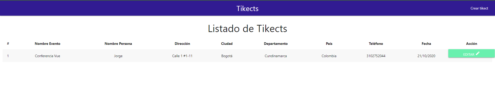
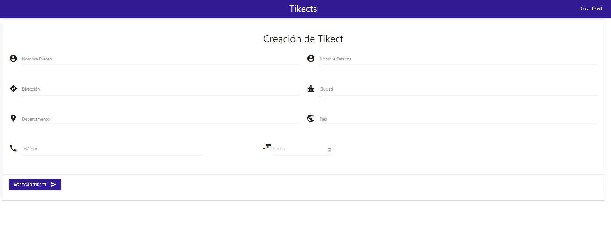
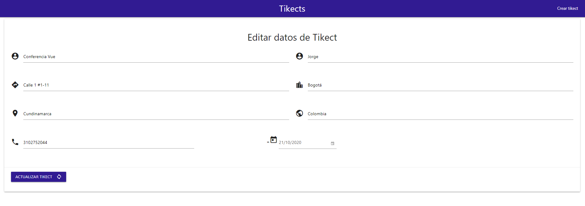

# App de Tikects

App Tikects

## ¿Cómo funciona?

Requiere Node.JS > 10

* `npm install` para instalar las dependencias
* `npm run start` para iniciar el entorno de desarrollo
* `npm run build` para generar app para entorno de producción

## Licencia

MIT